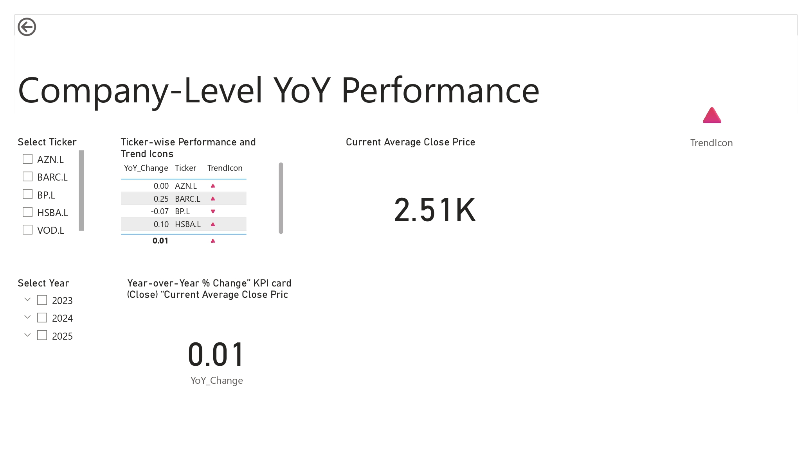

# 📊 FTSE 100 Stock Dashboard

This project visualizes historical stock data for companies in the **FTSE 100 index** using Power BI. It uses data from Yahoo Finance and highlights trends, average closing prices, and year-on-year changes.

## 📁 Files Included

- `ftse100_stocks.csv` – List of FTSE 100 company tickers
- `get_ftse100_data.py` – Python script to fetch historical stock data
- `yFinance.ipynb` – Jupyter notebook used for data retrieval and preprocessing
- `FSTE_100_Dashboard.pbix` – Power BI file with complete dashboard
- `FSTE_100_Dashboard_page_1.jpg` & `FSTE_100_Dashboard_page_1.jpg` – Image previews of the dashboard
- `README.md` – Project overview (this file)

## 📈 Dashboard Highlights

- Average closing price by company and year
- Year-on-Year (YoY) stock performance changes
- Trend indicator for quick interpretation
- Filters to explore data by company and year

## ⚙️ How to Use

1. Run the Python script (`get_ftse100_data.py`) or Jupyter notebook (`yFinance.ipynb`) to fetch updated stock data using yFinance.
2. Open the Power BI file (`FSTE_100_Dashboard.pbix`).
3. Refresh data to update visuals with new stock information.

## 📷 Preview

| Dashboard Page 1 | Dashboard Page 2 |
|------------------|------------------|
|  |  |

## 🛠 Tools Used

- [Power BI](https://powerbi.microsoft.com/)
- [Python](https://www.python.org/)
- [yFinance](https://pypi.org/project/yfinance/)
- GitHub

## 🙋‍♀️ Author

Kosi Etimbuk-Udoekong  
[www.linkedin.com/in/kosi-etimbuk-udoekong | [GitHub](https://github.com/)

---

Let me know if you'd like to personalize it more or want help embedding GitHub badges or interactivity.
